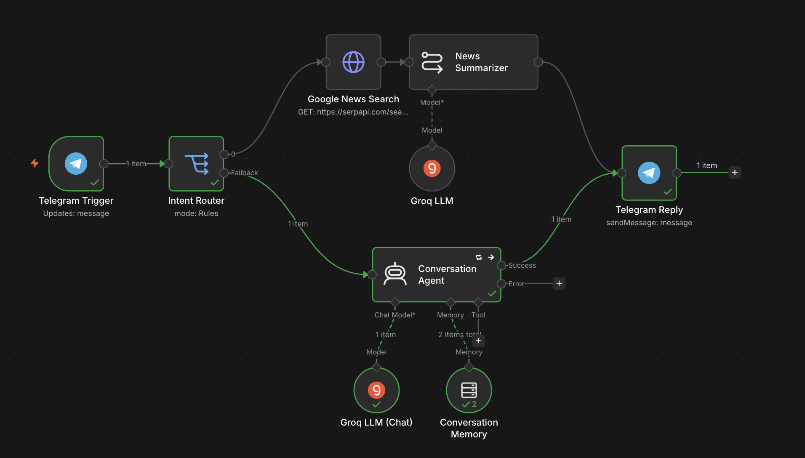
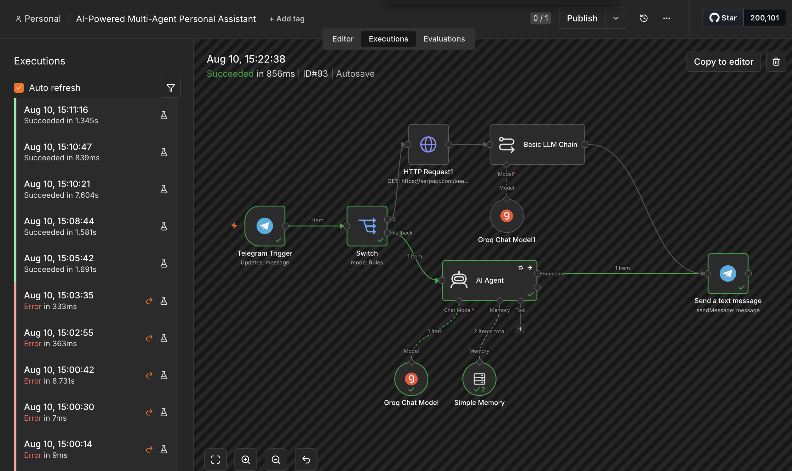

---

# 📸 Project Walkthrough

The following screenshots showcase Astra's workflow, execution process, and conversational capabilities.

## 🏗️ Workflow Architecture

Astra is built using a modular n8n workflow that intelligently routes user requests to either a conversational AI pipeline or a real-time search pipeline.

  

---

## 🔍 Detailed Workflow

This diagram illustrates the internal workflow, including intent routing, live search integration, memory handling, and response generation.

  

---

## ⚙️ Workflow Execution

The execution view demonstrates how individual nodes process user requests and exchange data throughout the workflow.

  

---

## 💬 Telegram Assistant Demo

Astra interacts naturally through Telegram, providing conversational responses while maintaining context.

<table>
<tr>
<td align="center">

### Conversation Example 1

</td>

<td align="center">

### Conversation Example 2

</td>
</tr>
</table>

---

## 🚨 Error Handling

The workflow includes built-in validation and error handling to improve reliability during execution and simplify debugging.

  

---
