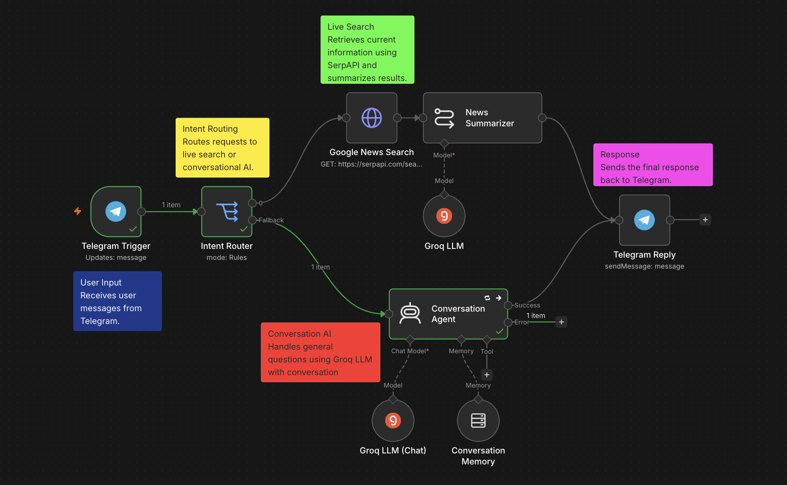
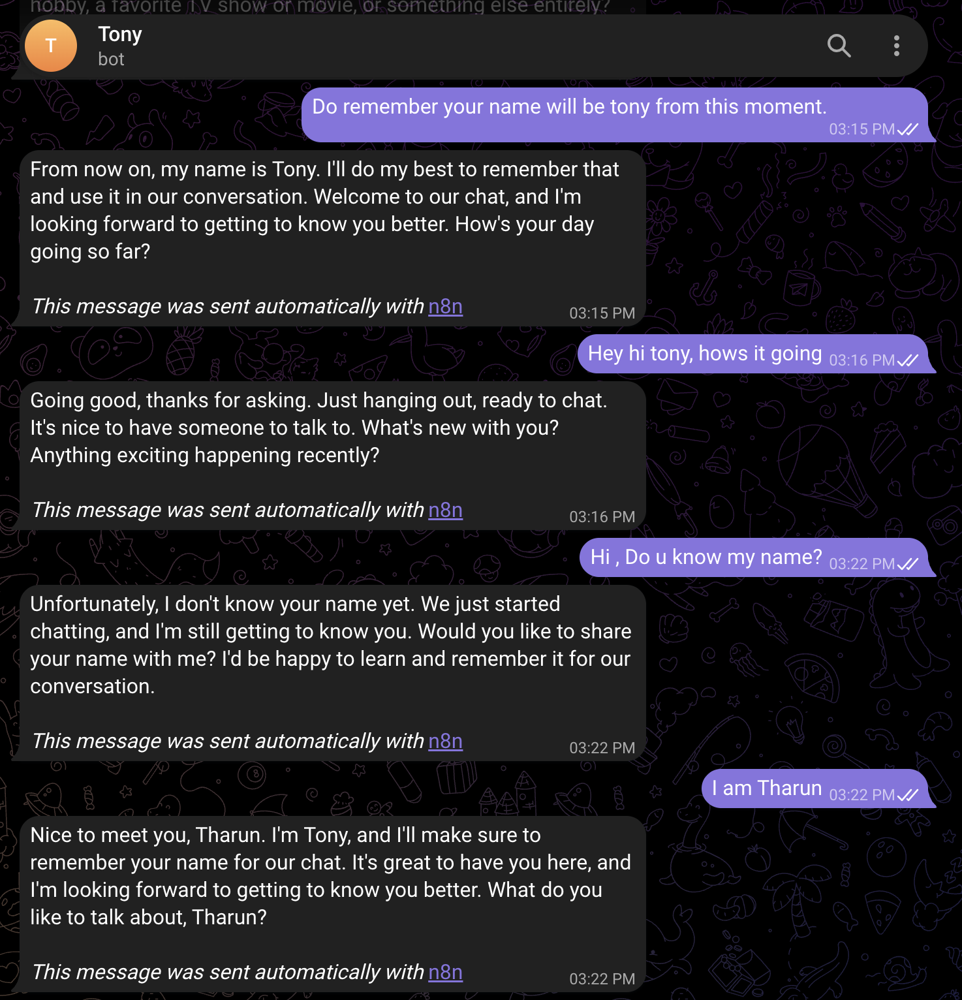
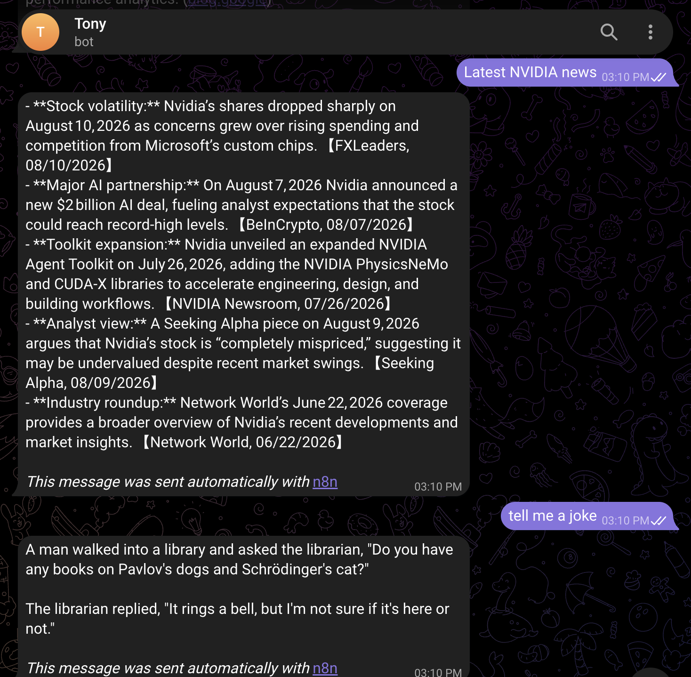
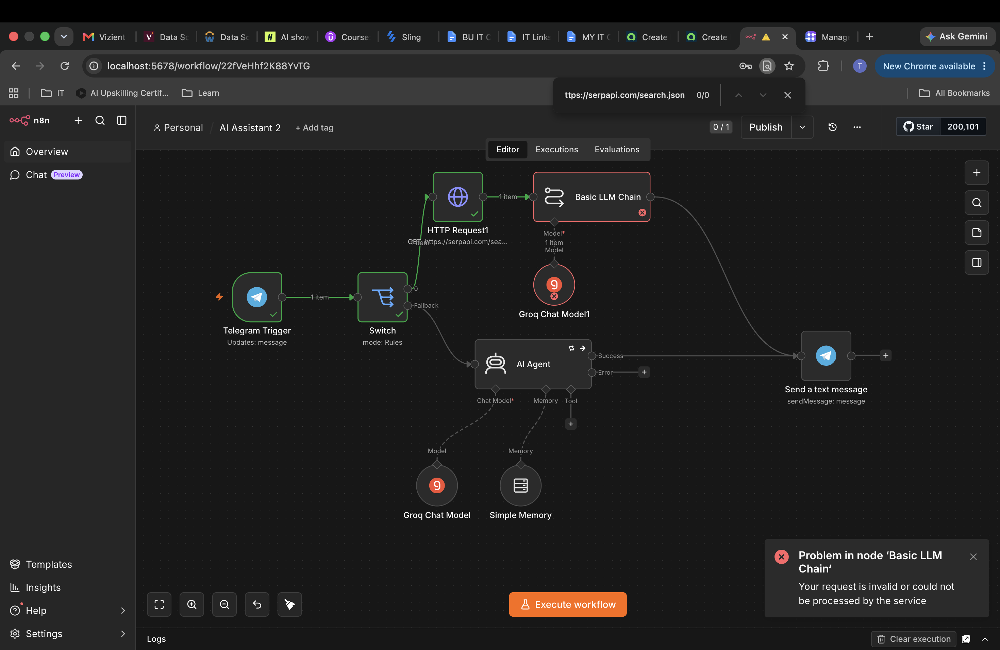

# 🌌 Astra AI Assistant

<div align="center">

# Astra

### AI-Powered Multi-Agent Personal Assistant

An intelligent multi-agent assistant that combines **Conversational AI**, **Real-Time Web Search**, and **Workflow Automation** into a seamless user experience.

[](LICENSE)


</div>

---

# 🚀 Overview

Astra is an AI-powered personal assistant built using **n8n**, **Groq LLM**, **Telegram Bot API**, and **SerpAPI**.

The assistant intelligently determines whether a user request requires:

- 🤖 Conversational AI
- 🌐 Real-time web search
- 🧠 Context-aware memory
- ⚡ Automated workflow execution

By combining workflow automation with modern LLMs and external APIs, Astra delivers fast, intelligent, and context-aware responses through Telegram.

The modular design also makes it easy to extend with additional capabilities such as voice assistance, Retrieval-Augmented Generation (RAG), document analysis, calendar management, and email automation.

---

# ✨ Features

- 🤖 Conversational AI powered by Groq LLM
- 🌐 Real-time web search using SerpAPI
- 💬 Telegram chatbot interface
- 🧠 Context-aware conversation memory
- 🔀 Intent-based routing using n8n
- ⚡ Workflow automation
- 🔌 REST API integration
- 🐳 Docker deployment
- 📦 Modular and scalable architecture

---

# 🛠️ Tech Stack

| Category | Technology |
|-----------|------------|
| Workflow Automation | n8n |
| Large Language Model | Groq |
| Messaging Platform | Telegram Bot API |
| Search API | SerpAPI |
| Containerization | Docker |
| APIs | REST APIs |
| Version Control | Git & GitHub |

---

# 🏗️ System Architecture

The following diagram illustrates Astra's modular architecture and request routing process.

<p align="center">

</p>

---

# 🔄 Workflow Overview

The workflow receives user requests through Telegram, classifies the intent, routes the request to the appropriate AI pipeline, and returns the response back to the user.

<p align="center">

</p>

---

# ⚙️ Detailed Workflow

The workflow below demonstrates how Astra processes user requests, integrates external APIs, manages conversational memory, and generates responses.

<p align="center">

</p>

---

# 📊 Workflow Execution

Execution logs show the orchestration of workflow nodes and successful processing of user requests.

<p align="center">

</p>

---

# 💬 Telegram Assistant

Astra interacts naturally through Telegram while maintaining contextual conversations.

## 🧠 Context-Aware Conversations

The assistant remembers information shared during the conversation, enabling more natural and personalized interactions.

<p align="center">

</p>

---

## 🌐 Real-Time Search

Astra automatically switches to live web search whenever users request current information, delivering concise AI-generated summaries.

<p align="center">

</p>

---

# 🚨 Error Handling

The workflow includes routing validation and execution monitoring to simplify debugging and improve reliability.

<p align="center">

</p>

---

# 📂 Project Structure

```text
astra-ai-assistant/
│
├── assets/
│   └── architecture.png
│
├── docs/
│
├── screenshots/
│   ├── workflow.png
│   ├── detailed-workflow.png
│   ├── executions.png
│   ├── telegram-chat-1.png
│   ├── telegram-chat-2.png
│   └── workflow-error.png
│
├── workflow/
│   └── Astra-AI Assistant.json
│
├── README.md
├── LICENSE
└── .gitignore
```

---

# ⚙️ Installation

## Clone the repository

```bash
git clone https://github.com/Tharuncode6/astra-ai-assistant.git

cd astra-ai-assistant
```

---

## Import the Workflow

1. Install Docker
2. Install n8n
3. Launch the n8n Editor
4. Import the workflow JSON located in the `workflow` folder
5. Configure the required credentials
6. Activate the workflow

---

## Required Credentials

Configure the following credentials before running Astra:

- Groq API Key
- Telegram Bot Token
- SerpAPI Key

---

# 💬 Example Queries

### General Conversation

```
Explain Machine Learning.

Write a Python function to perform binary search.

Help me write a professional email.

Tell me a joke.
```

### Live Search

```
Latest AI news

Weather in Boston

Bitcoin price today

Latest NVIDIA announcements

Latest OpenAI news
```

---

# 📚 Skills Demonstrated

- AI Workflow Automation
- Multi-Agent AI Systems
- Prompt Engineering
- Large Language Model Integration
- REST API Integration
- Telegram Bot Development
- Docker Deployment
- Workflow Design
- Context Management
- Software Documentation

---

# 🛣️ Roadmap

### ✅ Version 1.0

- Telegram Assistant
- Conversational AI
- Real-Time Search
- Conversation Memory
- Docker Deployment

### 🚀 Future Enhancements

- 🎤 Voice Assistant
- 🧠 Long-Term Memory using Vector Databases
- 📄 Retrieval-Augmented Generation (RAG)
- 📧 Gmail Integration
- 📅 Google Calendar Integration
- 🌦 Weather API
- 📈 Stock Market API
- 🌍 Multi-language Support
- 🖥 Web Dashboard

---

# 🤝 Contributing

Contributions, feature requests, and suggestions are welcome.

Feel free to fork the repository and submit a pull request.

---

# 📄 License

This project is licensed under the **MIT License**.

See the **LICENSE** file for additional information.

---

# 👨‍💻 Author

**Tharun Reddy**

- GitHub: https://github.com/Tharuncode6

---

<div align="center">

### ⭐ If you found Astra interesting, consider giving the repository a star!

**Built with ❤️ using n8n, Groq, Telegram Bot API, and SerpAPI**

</div>
